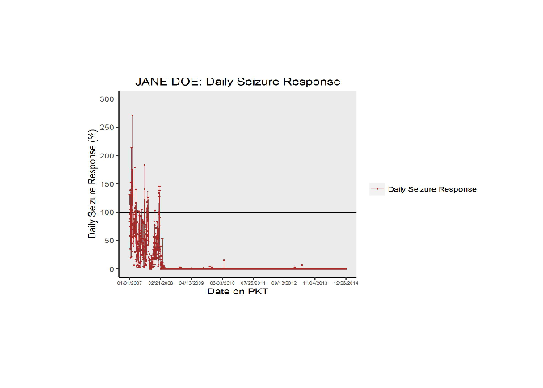
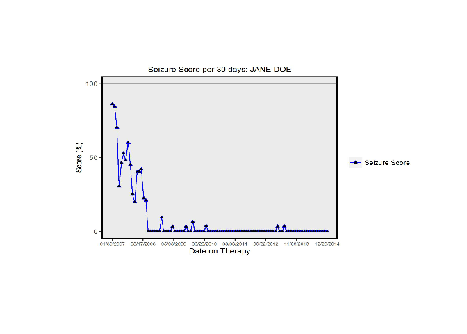
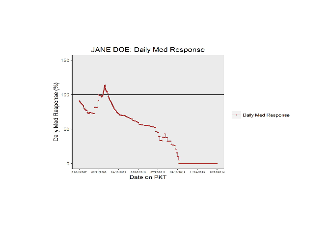
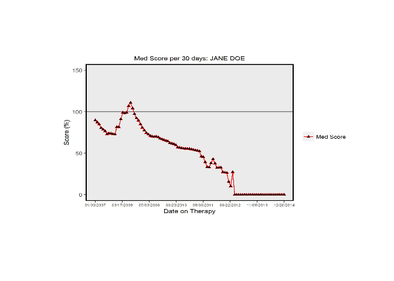
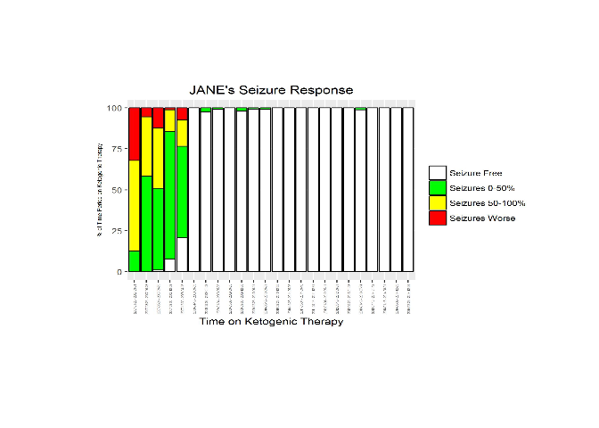
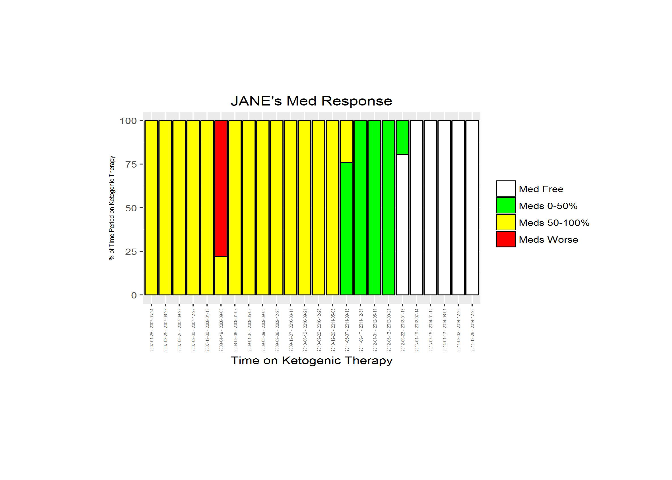
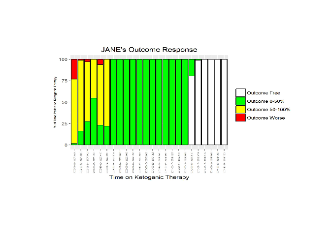

### R/clinicalresponse

The aim of this package is to all clinics caring for patients with epilepsy to be able to calculate various response values using collected data. Currently this package calculates a seizure score, med score, and outcome and can be used to provide feedback to clinicians and caregivers on the seizure and med progress of patients receiving a therapy for epilepsy.

Before installing this package, you will need to ensure that two packages are installed into your R session: rJava and xlsx. If they are not, type this into your R console:

``` r
install.packages("rJava")
install.packages("xlsx")
library(xlsx)
```

Note that this package makes use of the rJava package in order to enable you to read Excel (xlsx) files into your R session and save Excel (xlsx) files onto your computer. You will need to ensure that you have Java installed on your computer and that the version of R or RStudio you are using matches the version of Java that you have (in RStudio, click on Tools -&gt; Global Options -&gt; General to change the version of R you are using if necessary).

To install the package, type these lines of code into your R console:

``` r
install.packages("devtools")
devtools::install_github("borumlab/response")
```

If the package installs without errors (if this is the case, you should see `* DONE (clinicalresponse)` displayed on the console), type this into the console to load the package:

``` r
library(clinicalresponse)
```

#### Data Dictionary

There are various Excel tables that will be needed to run the scripts in this package, and each script will give some output, to include Excel files and for some scripts, at least one graph (line plots and bar graphs created using the [ggplot2](https://cran.r-project.org/web/packages/ggplot2/ggplot2.pdf) package). A description of each file needed to run the scripts, as well as the output Excel files, can be found in the DATA\_DICTIONARY.xlsx file that is included in this package.

#### Example Data

Upon installing and loading this package, there will an example dataset loaded into your R session. These files are named as follows:

-   CLINIC\_VISIT\_SOURCE
-   DEMOGRAPHICS\_SOURCE
-   MED\_RANKING\_SOURCE
-   PATIENT1\_ANTHROPOMETRICS\_SOURCE
-   PATIENT1\_MED\_DATA\_SOURCE
-   PATIENT1\_SEIZURE\_DATA\_SOURCE
-   PATIENT1\_SEIZURE\_RANKING\_SOURCE

Each of these files will exist within your R session as data frames. You can view these data frames by typing the name of the data frame, as listed above, into your R console:

``` r
MED_RANKING_SOURCE
```

    ##    MED_GENERIC_NAME            MED_BRAND_NAME  MED_ID MED_UNIT
    ## 1     Carbamazepine        Carbatrol,Tegretol MID0001     YEAR
    ## 2     Carbamazepine        Carbatrol,Tegretol MID0001     YEAR
    ## 3     Carbamazepine        Carbatrol,Tegretol MID0001     YEAR
    ## 4          Clobazam                      Onfi MID0002     YEAR
    ## 5        Clonazepam                  Klonopin MID0003       KG
    ## 6        Clonazepam                  Klonopin MID0003       KG
    ## 7       Clorazepate                  Tranxene MID0004     YEAR
    ## 8       Clorazepate                  Tranxene MID0004     YEAR
    ## 9          Diazepam                      <NA> MID0005     YEAR
    ## 10         Diazepam                      <NA> MID0005     YEAR
    ## 11     Ethosuximide                  Zarontin MID0006     YEAR
    ## 12     Ethosuximide                  Zarontin MID0006     YEAR
    ## 13        Felbamate                  felbatol MID0007     YEAR
    ## 14        Felbamate                  felbatol MID0007     YEAR
    ## 15       Gabapentin                 Neurontin MID0008     YEAR
    ## 16       Gabapentin                 Neurontin MID0008     YEAR
    ## 17       Gabapentin                 Neurontin MID0008     YEAR
    ## 18       Lacosamide                    Vimpat MID0009     YEAR
    ## 19      Lamotrigine                  Lamictal MID0010     YEAR
    ## 20      Lamotrigine                  Lamictal MID0010     YEAR
    ## 21    Levetiracetam                    Keppra MID0011     YEAR
    ## 22    Levetiracetam                    Keppra MID0011     YEAR
    ## 23        Lorazepam                    Ativan MID0012     YEAR
    ## 24        Lorazepam                    Ativan MID0012     YEAR
    ## 25    Mephobarbital                   Mebaral MID0013     YEAR
    ## 26    Mephobarbital                   Mebaral MID0013     YEAR
    ## 27    Oxcarbazepine                 Trileptal MID0014     YEAR
    ## 28    Oxcarbazepine                 Trileptal MID0014     YEAR
    ## 29    Phenobarbital                      <NA> MID0015     YEAR
    ## 30    Phenobarbital                      <NA> MID0015     YEAR
    ## 31    Phenobarbital                      <NA> MID0015     YEAR
    ## 32    Phenobarbital                      <NA> MID0015     YEAR
    ## 33        Phenytoin                  Dilantin MID0016     YEAR
    ## 34        Phenytoin                  Dilantin MID0016     YEAR
    ## 35        Phenytoin                  Dilantin MID0016     YEAR
    ## 36        Phenytoin                  Dilantin MID0016     YEAR
    ## 37        Phenytoin                  Dilantin MID0016     YEAR
    ## 38        Phenytoin                  Dilantin MID0016     YEAR
    ## 39        Phenytoin                  Dilantin MID0016     YEAR
    ## 40        Primidone                  Mysoline MID0017     YEAR
    ## 41        Primidone                  Mysoline MID0017     YEAR
    ## 42        Primidone                  Mysoline MID0017     YEAR
    ## 43       Rufinamide                    Banzel MID0018     YEAR
    ## 44       Rufinamide                    Banzel MID0018     YEAR
    ## 45        Tiagabine                  Gabitril MID0019     YEAR
    ## 46        Tiagabine                  Gabitril MID0019     YEAR
    ## 47        Tiagabine                  Gabitril MID0019     YEAR
    ## 48       Topiramate                   Topamax MID0020     YEAR
    ## 49       Topiramate                   Topamax MID0020     YEAR
    ## 50       Topiramate                   Topamax MID0020     YEAR
    ## 51     ValproicAcid Depakene,Depakote,Depacon MID0021     YEAR
    ## 52       Vigabatrin                    Sabril MID0022     YEAR
    ## 53       Vigabatrin                    Sabril MID0022     YEAR
    ## 54       Vigabatrin                    Sabril MID0022     YEAR
    ## 55       Vigabatrin                    Sabril MID0022     YEAR
    ## 56       Zonisamide                  Zonegran MID0023     YEAR
    ## 57       Zonisamide                  Zonegran MID0023     YEAR
    ##    MED_LIMIT_LOW MED_LIMIT_HIGH MED_MIN_DOSE MED_MAX_DOSE
    ## 1          0.000          6.000       10.000        35.00
    ## 2          6.000         12.010       15.000        35.00
    ## 3         12.010        150.000       19.600        29.40
    ## 4          0.000        150.000        0.300         1.30
    ## 5          0.000         30.000        0.100         0.20
    ## 6         30.000        200.000        0.100         0.70
    ## 7          0.000         12.010        0.200         1.50
    ## 8         12.010        150.000        0.500         3.00
    ## 9          0.000         19.010        0.090         0.30
    ## 10        19.010        150.000        0.030         0.60
    ## 11         0.000          6.010       15.000        40.00
    ## 12         6.010        150.000       20.000        40.00
    ## 13         0.000         14.010       15.000       156.40
    ## 14        14.010        150.000       23.700        70.90
    ## 15         0.000          5.010       40.000        50.00
    ## 16         5.010         12.010       25.000        50.00
    ## 17        12.010        150.000       21.600        57.50
    ## 18         0.000        150.000        3.300         6.70
    ## 19         0.000         12.010        1.000        15.00
    ## 20        12.010        150.000        2.400        14.40
    ## 21         0.000         16.000       16.700        50.00
    ## 22        16.000        150.000       17.400        52.20
    ## 23         0.000         12.010        0.020         0.20
    ## 24        12.010        150.000        0.025         0.05
    ## 25         0.000         19.000        6.000        12.00
    ## 26        19.000        150.000        3.200         9.50
    ## 27         0.000         16.010       18.500        30.00
    ## 28        16.010        150.000       20.900        41.70
    ## 29         0.000          0.084        3.000         5.00
    ## 30         0.084          7.010        4.000         8.00
    ## 31         7.010         19.000        3.000         6.00
    ## 32        19.000        150.000        1.000         3.00
    ## 33         0.000          0.500        4.000         8.00
    ## 34         0.500          1.000        5.000        10.00
    ## 35         1.000          4.000       10.000        29.80
    ## 36         4.000          7.000        7.500        18.60
    ## 37         7.000         10.000        7.000        13.00
    ## 38        10.000         17.000        6.000         9.20
    ## 39        17.000        150.000        4.000         5.00
    ## 40         0.000          0.083       12.000        20.00
    ## 41         0.083          8.000       10.000        25.00
    ## 42         8.000        150.000       29.100        77.70
    ## 43         0.000         19.000       10.000        45.00
    ## 44        19.000        150.000        6.300        50.60
    ## 45         0.000         12.000        0.400         1.00
    ## 46        12.000         19.000        0.600         0.90
    ## 47        19.000        150.000        0.500         0.90
    ## 48         0.000          2.000        7.700         9.00
    ## 49         2.000         16.000        5.000         9.00
    ## 50        16.000        150.000        3.500        15.60
    ## 51         0.000        150.000       10.000        60.00
    ## 52         0.000          2.000       50.000       150.00
    ## 53         2.000         10.000       55.000       100.00
    ## 54        10.000         17.000       47.000       100.00
    ## 55        17.000        150.000       50.000       100.00
    ## 56         0.000         16.000        4.000        12.00
    ## 57        16.000        150.000        1.700        10.40

Your data will need to be organized as these tables are in order for the scripts to function properly. For the tables with prefix "PATIENT1", each individual patient will have a file of that type storing that data that is unique to them, replacing "PATIENT1" with the identifier that you wish to use for that patient. There will be only one of the other three table: the MED\_RANKING\_SOURCE.xlsx file will be the same for all patients, whereas the CLINIC\_VISIT\_SOURCE.xlsx and the DEMOGRAPHICS\_SOURCE.xlsx files will store data for all patients within the same files. When you create your Excel files, they will all need to have the same name as given to the Example data frames seen here, with the exception of replacing "PATIENT1" with each patient's unique identifier. For more information about creating your files and on entering data, please read the README DATA ENTRY word document in this package folder.

#### Calculating seizure response values

The first step in calculating seizure response values will be to obtain the seizure load. In this process, seizure load is defined as \[include definition of seizure load here\] per day. Also of interest is seizure number, which is the number of seizures that a patient has per day. These values will be needed in order to calculate seizure response values.

To calculate daily seizure loads and seizure numbers, type this into your R console:

``` r
calculate_seizure_load()
```

First, the function will prompt you to enter some unique identifier (e.g. FiLa, denoting the first two letters of the patient's first name and the first two letters of the patient's last name) that signifies the patient you wish to run the script on. Note that identifier must exactly match the identifier found in that patient's Excel file names.

    ## [1] "Input the identifier that signify the patient we are doing calculations for"

    ## [1] "Example: FILA"

    ## Enter here: PATIENT1

Next, you will be asked to set the working directory in which the SEIZURE\_DATA\_SOURCE.xlsx file can be found in. Once the location of this file has been set, the script will look for a file named \[PATIENT1\]\_SEIZURE\_DATA\_SOURCE.xlsx and read it into R.

    ## [1] "Input the directory that you wish to draw this patient's SEIZURE_DATA_SOURCE file from"

    ## [1] "Example: C:/Folder_Name/"

    ## Enter here: C:/Desktop/Patient Folder/PATIENT1/Data/

Then, R will need to load in the SEIZURE\_RANKING\_SOURCE.xlsx file. You will be asked whether this file exists in the same folder as the SEIZURE\_DATA\_SOURCE.xlsx file or not. If so, type 'yes'. If not, type 'no', and you will be prompted to specify the folder in which this file can be found on your computer.

    ## [1] "Type 'yes' if this patient's SEIZURE_RANKING_SOURCE file can be found in the same folder as the SEIZURE_DATA_SOURCE table. Type 'no' if it is in a different folder"

    ## Enter here: no

    ## [1] "Input the directory that you wish to draw this patient's SEIZURE_RANKING_SOURCE file from"

    ## [1] "Example: C:/Folder_Name/"

    ## Enter here: C:/Desktop/Patient Folder/PATIENT1/Ranking/

Once the seizure raw data table and the seizure ranking table have been loaded into R, the calculation of seizure load will begin. As each step is done, you will see the following output in your console:

    ## [1] "Calculating ranks. Please wait..."

    ## [1] "Calculating sums for missing days. Please wait..."

    ## [1] "Now calculating daily seizure loads. Please wait..."

Once daily seizure loads have been calculated, you will be asked if you wish to save PATIENT1\_SEIZURE\_LOAD.xlsx on your computer.

    ## [1] "Would you like to save a temporary file to look at the seizure loads?"

    ## [1] "Type 'YES' to save a file to look at, type 'NO' to move onto next step"

    ## Enter here: yes

If you were to type no here, we would skip this step and move on to the calculation of seizure response. If you typed yes, you will be asked where you would like to save the file.

    ## [1] "Input the directory that you wish to save this patient's SEIZURE_LOAD file in"

    ## [1] "Example: C:/Folder_Name/"

    ## Enter here: C:/Desktop/Patient Folder/PATIENT1/Data/

    ## [1] "Saving seizure load table as PATIENT1_SEIZURE_LOAD.xlsx in directory C:/Desktop/Patient Folder/PATIENT1/Data/"

And then you will be given the chance to open and view your file for review. If you are satisfied and would like to move on to seizure response calculation, type 'OKAY', otherwise, you can type 'QUIT' to end the script.

    ## [1] "Type 'OKAY' whenever you are ready to move on to the next step"

    ## [1] "Or type 'QUIT' if you would like to exit"

    ## Enter here: OKAY

Next, you will use the daily seizure loads in order to calculate seizure response values. These values include percent seizure free (percent of days without seizures during baseline time period or a 30-day time period), seizure response per day (percent change in seizure days from baseline to a day on therapy) and seizure response per 30 day period (percent change in seizure days from baseline to a 30 day time period on therapy), percent seizure free response per 30 day period (percent change in seizure freedom from baseline to 30 day time period on therapy), seizure score per 30 day period (percent change in seizure free and seizure days from baseline to a 30 day time period on therapy), and seizure number response per day (percent change in seizure days from baseline to a day on therapy) and seizure response per 30 day period (percent change in seizure days from baseline to a 30 day time period on therapy). The formulas used to calculate these values can be found in the EQUATIONS word document. Note that this process will only occur if the patient has days classified as therapy days.

    ## [1] "The percentage of baseline days with no seizures is: [number]%"

    ## [1] "Response and scores have been calculated"

If the patient has a baseline day with seizure load greater than 0, a scatter plot of the daily seizure responses will be created, and if the patient has any therapy days, then a line plot of the seizure scores per 30 days will be created. You will first be asked where the DEMOGRAPHICS\_SOURCE.xlsx file is (this is so that the patient's name can be drawn from the file and displayed on the graphs).

    ## [1] "Input the directory that you wish to draw the DEMOGRAPHICS_SOURCE file from"

    ## [1] "Example: C:/Folder_Name/"

    ## Enter here:  C:/Desktop/Patient Folder/PATIENT1/Demographics/

You will then be asked if you would like the graphs to be saved in the same folder as the SEIZURE\_LOAD.xlsx file. Type 'yes' if you do, or type 'no' if you would like to save it somewhere else. If you type 'no', you will be asked where you would like this file to be saved.

    ## [1] "Type 'yes' if you wish to save all graphs in the same folder as this patient's SEIZURE_LOAD file. Type 'no' if you would like for them to be in a different folder"

    ## Enter here: no

    ## [1] "Input the directory that you wish to save this patient's seizure graphs in"

    ## [1] "Example: C:/Folder_Name/"

    ## Enter here: C:/Desktop/Patient Folder/PATIENT1/Data/

Then your graphs will be created and saved.

    ## [1] "PATIENT1_SEIZURE_DAILY_GRAPH.jpeg created and saved in the patient folder"

    ## [1] "PATIENT1_SEIZURE_SCORE_GRAPH.jpeg created and saved in the patient folder"



Finally, the seizure response values will be saved to your computer. You will be asked if you would like this file to be saved in the same folder as the SEIZURE\_LOAD.xlsx file. Type 'yes' if you do, or type 'no' if you would like to save it somewhere else. If you type 'no', you will be asked where you would like this file to be saved.

    ## [1] "Type 'yes' if you wish to save this patient's SEIZURE_DATA_CLINICAL file in the same folder as this patient's SEIZURE_LOAD file. Type 'no' if you would like for it to be in a different folder"

    ## Enter here: no

    ## [1] "Input the directory that you wish to save this patient's SEIZURE_DATA_CLINICAL file in"

    ## [1] "Example: C:/Folder_Name/"

    ## Enter here: C:/Desktop/Patient Folder/PATIENT1/Data/

    ## [1] "Saving seizure clinical outcome table as PATIENT1_SEIZURE_DATA_CLINICAL in directory C:/Desktop/Patient Folder/PATIENT1/Data/"

If your patient does not have any days labeled as therapy days, then this will print on your console:

    ## [1] "No therapy days, therefore response and score values will not be calculated"

In this case, you will not be given any seizure reponse output.

#### Calculating med response values

Similarly to seizure response, the first step in calculating med response values will be to obtain the med load. In this process, med load is defined as \[include definition of med load here\] per day. Also of interest is med number, which is the number of meds prescribed to a patient per day. These values will be needed in order to calculate med response values.

To calculate daily med loads and med numbers, type this into your R console:

``` r
calculate_med_load()
```

First, the function will prompt you to enter some unique identifier (e.g. FiLa, denoting the first two letters of the patient's first name and the first two letters of the patient's last name) that signifies the patient you wish to run the script on.

    ## [1] "Input the identifier that signify the patient we are doing calculations for"

    ## [1] "Example: FILA"

    ## Enter here: PATIENT1

Next, you will be asked to set the work directory in which the DEMOGRAPHICS\_SOURCE.xlsx file can be found in. Once the location of this file has been set, the script will look for a file named DEMOGRAPHICS\_SOURCE.xlsx and read it into R.

    ## [1] "Input the directory that you wish to draw this patient's DEMOGRAPHICS_SOURCE file from"

    ## [1] "Example: C:/Folder_Name/"

    ## Enter here: C:/Desktop/Patient Folder/PATIENT1/Demographics/

Then, R will need to load in the MED\_RANKING\_SOURCE.xlsx file. You will be asked whether this file exists in the same folder as the DEMOGRAPHICS\_SOURCE.xlsx file or not. If so, type 'yes'. If not, type 'no', and you will be prompted to specify the folder in which this file can be found on your computer.

    ## [1] "Type 'yes' if the MED_RANKING_SOURCE file can be found in the same folder as the DEMOGRAPHICS_SOURCE table. Type 'no' if it is in a different folder"

    ## Enter here: no

    ## [1] "Input the directory that you wish to draw this patient's MED_RANKING_SOURCE file from"

    ## [1] "Example: C:/Folder_Name/"

    ## Enter here: C:/Desktop/Patient Folder/PATIENT1/Ranking/

Then, R will need to load in the ANTHROPOMETRICS\_SOURCE.xlsx file. Since med load requires milligrams of medication per kilogram weight of the patient, weight data needs to be incorporated into the med load calculations. You will be asked whether this file exists in the same folder as the MED\_RANKING\_SOURCE.xlsx file or not. If so, type 'yes'. If not, type 'no', and you will be prompted to specify the folder in which this file can be found on your computer.

    ## [1] "Type 'yes' if this patient's ANTHROPOMETRICS_SOURCE file can be found in the same folder as the MED_RANKING_SOURCE table. Type 'no' if it is in a different folder"

    ## Enter here: no

    ## [1] "Input the directory that you wish to draw this patient's ANTHROPOMETRICS_SOURCE file from"

    ## [1] "Example: C:/Folder_Name/"

    ## Enter here: C:/Desktop/Patient Folder/PATIENT1/Anthropometrics/

Lastly, R will need to load in the MED\_DATA\_SOURCE.xlsx file. You will be asked whether this file exists in the same folder as the ANTHROPOMETRICS\_SOURCE.xlsx file or not. If so, type 'yes'. If not, type 'no', and you will be prompted to specify the folder in which this file can be found on your computer.

    ## [1] "Type 'yes' if this patient's MED_DATA_SOURCE file can be found in the same folder as this patient's ANTHROPOMETRICS_SOURCE table. Type 'no' if it is in a different folder"

    ## Enter here: no

    ## [1] "Input the directory that you wish to draw this patient's MED_DATA_SOURCE file from"

    ## [1] "Example: C:/Folder_Name/"

    ## Enter here: C:/Desktop/Patient Folder/PATIENT1/Data/

Once the med raw data table, the med ranking table, the anthropometrics table, and the demographics table have been loaded into R, the calculation of med load will begin. As each step is done, you will see the following output in your console:

    ## [1] "Calculating med intake in mg/kg/day, please wait..."

    ## [1] "Calculating minimum dose in mg/kg/day, please wait..."

    ## [1] "Calculating med load per day, please wait..."

Once daily med loads have been calculated, you will be asked if you wish to save a PATIENT1\_MED\_LOAD.xlsx file on your computer.

    ## [1] "Would you like to save a temporary file to look at the med loads?"

    ## [1] "Type 'YES' to save a file to look at, type 'NO' to move onto next step"

    ## Enter here: yes

If you were to type no here, we would skip this step and move on to the calculation of med response. If you typed yes, you will be asked where you would like to save the file.

    ## [1] "Input the directory that you wish to save this patient's MED_LOAD file from"

    ## [1] "Example: C:/Folder_Name/"

    ## Enter here: C:/Desktop/Patient Folder/PATIENT1/Data/

    ## [1] "Saving seizure load table as PATIENT1_MED_LOAD.xlsx in directory C:/Desktop/Patient Folder/PATIENT1/Data/"

And then you will be given the chance to open and view your file for review. If you are satisfied and would like to move on to seizure response calculation, type 'OKAY', otherwise, you can type 'QUIT' to end the script.

    ## [1] "Type 'OKAY' whenever you are ready to move on to the next step"

    ## [1] "Or type 'QUIT' if you would like to exit"

    ## Enter here: OKAY

Next, you will use the daily med loads in order to calculate med response values. These values include percent med free (percent of days without meds during baseline time period or a 30-day time period), med response per day (percent change in med days from baseline to a day on therapy) and med response per 30 day period (percent change in med days from baseline to a 30 day time period on therapy)), percent med free response per 30 day period (percent change in med freedom from baseline to 30 day time period on therapy), med score per 30 day period (percent change in med free and med days from baseline to a 30 day time period on therapy), and med number response per day and per 30 day period (percent change in seizure days from baseline to a 30 day time period on therapy). The formulas used to calculate these values can be found in the EQUATIONS word document. Note that this process will only occur if the patient has days classified as therapy days.

    ## [1] "The percentage of baseline days with no meds is: [number]%"

    ## [1] "Response and scores have been calculated"

You will be asked if you would like the graphs to be saved in the same folder as the MED\_LOAD.xlsx file. Type 'yes' if you do, or type 'no' if you would like to save it somewhere else. If you type 'no', you will be asked where you would like this file to be saved.

    ## [1] "Type 'yes' if you wish to save all graphs in the same folder as this patient's MED_LOAD file. Type 'no' if you would like for them to be in a different folder"

    ## Enter here: no

    ## [1] "Input the directory that you wish to save this patient's med graphs in"

    ## [1] "Example: C:/Folder_Name/"

    ## Enter here: C:/Desktop/Patient Folder/PATIENT1/Data/

Then the graphs will be created and saved.

    ## [1] "PATIENT1_MED_DAILY_GRAPH.jpeg created and saved"

    ## [1] "PATIENT1_MED_SCORE_GRAPH.jpeg created and saved"



Finally, the med response values will be saved to your computer. You will be asked if you would like this file to be saved in the same folder as the MED\_LOAD.xlsx file. Type 'yes' if you do, or type 'no' if you would like to save it somewhere else. If you type 'no', you will be asked where you would like this file to be saved.

    ## [1] "Type 'yes' if you wish to save this patient's MED_DATA_CLINICAL file in the same folder as this patient's MED_LOAD file. Type 'no' if you would like for it to be in a different folder"

    ## Enter here: no

    ## [1] "Input the directory that you wish to save this patient's MED_DATA_CLINICAL file in"

    ## [1] "Example: C:/Folder_Name/"

    ## Enter here: C:/Desktop/Patient Folder/PATIENT1/Data/

    ## [1] "Saving seizure clinical outcome table as PATIENT1_MED_DATA_CLINICAL in directory C:/Desktop/Patient Folder/PATIENT1/Data/"

#### Calculating outcome values

The final step is calculating outcome, which is defined as the average of the seizure score and med score, which will give you a description of a patient's general state concerning seizures and anti-epileptic medications at a given point in time. The specific formula used to calculate outcome can be found in the EQUATIONS word document.

Note that calculation of outcome cannot be done unless you have had both the SEIZURE\_DATA\_CLINICAL.xlsx and the MED\_DATA\_CLINICAL.xlsx files for that patient created by the seizure and med scripts.

To calculate outcome per 30 day period of time, type this into your R console:

``` r
calculate_outcome()
```

First, the function will prompt you to enter the unique identifier (e.g. FiLa, denoting the first two letters of the patient's first name and the first two letters of the patient's last name) that signifies the patient you wish to run the script on.

    ## [1] "Input the identifier that signify the patient we are doing calculations for"

    ## [1] "Example: FILA"

    ## Enter here: PATIENT1

Next, you will be asked to set the work directory in which the CLINIC\_VISIT\_SOURCE.xlsx file can be found in. Once the location of this file has been set, the script will look for a file named CLINIC\_VISIT\_SOURCE.xlsx and read it into R.

    ## [1] "Input the directory that you wish to draw the CLINIC_VISIT_SOURCE file from"

    ## [1] "Example: C:/Folder_Name/"

    ## Enter here: C:/Desktop/Patient Folder/PATIENT1/Clinic_Visit/

Then, R will need to load in the DEMOGRAPHICS\_SOURCE.xlsx file. You will be asked whether this file exists in the same folder as the CLINIC\_VISIT\_SOURCE.xlsx file or not. If so, type 'yes'. If not, type 'no', and you will be prompted to specify the folder in which this file can be found on your computer.

    ## [1] "Type 'yes' if the DEMOGRAPHICS_SOURCE file can be found in the same folder as the CLINIC_VISIT_SOURCE table. Type 'no' if it is in a different folder"

    ## Enter here: no

    ## [1] "Input the directory that you wish to draw the DEMOGRAPHICS_SOURCE file from"

    ## [1] "Example: C:/Folder_Name/"

    ## Enter here: C:/Desktop/Patient Folder/PATIENT1/Demographics/

Then, R will need to load in the SEIZURE\_DATA\_CLINICAL.xlsx file. You will be asked whether this file exists in the same folder as the DEMOGRAPHICS\_SOURCE.xlsx file or not. If so, type 'yes'. If not, type 'no', and you will be prompted to specify the folder in which this file can be found on your computer.

    ## [1] "Type 'yes' if this patient's SEIZURE_DATA_CLINICAL file can be found in the same folder as the DEMOGRAPHICS_SOURCE table. Type 'no' if it is in a different folder"

    ## Enter here: no

    ## [1] "Input the directory that you wish to draw this patient's SEIZURE_DATA_CLINCAL file from"

    ## [1] "Example: C:/Folder_Name/"

    ## Enter here: C:/Desktop/Patient Folder/PATIENT1/Data/

Lastly, R will need to load in the MED\_DATA\_CLINICAL.xlsx file. You will be asked whether this file exists in the same folder as the SEIZURE\_DATA\_CLINICAL.xlsx file or not. If so, type 'yes'. If not, type 'no', and you will be prompted to specify the folder in which this file can be found on your computer.

    ## [1] "Type 'yes' if this patient's MED_DATA_CLINICAL file can be found in the same folder as this patient's SEIZURE_DATA_CLINICAL table. Type 'no' if it is in a different folder"

    ## Enter here: no

    ## [1] "Input the directory that you wish to draw this patient's MED_DATA_CLINCAL file from"

    ## [1] "Example: C:/Folder_Name/"

    ## Enter here: C:/Desktop/Patient Folder/PATIENT1/Data/

Once the outcome values are calculated, you will be asked if you would like to save the OUTCOME\_DATA\_CLINICAL.xlsx file in the same location as the MED\_DATA\_CLINICAL.xlsx table. If so, type 'yes'. If not, type 'no' and you will be asked where you would like to save the file.

    ## [1] "Type 'yes' if you wish to save the OUTCOME_DATA_CLINICAL file in the same folder as this patient's MED_DATA_CLINICAL table. Type 'no' if you would like for it to be in a different folder"

    ## Enter here: no

    ## [1] "Input the directory that you wish to save this patient's OUTCOME_DATA_CLINICAL file in"

    ## [1] "Example: C:/Folder_Name/"

    ## Enter here: C:/Desktop/Patient Folder/PATIENT1/Data/

    ## [1] "Saving data clinical outcome table as PATIENT1_OUTCOME_DATA_CLINICAL.xlsx in directory C:/Desktop/Patient Folder/PATIENT1/Data/"

R will then create for you three bar graphs: one for seizures, one for meds, and one for outcome. These graphs will show you the percentage of each clinic period that were seizure/med/outcome free, 0-50% of what was observed during baseline, 50-100% of what was observed during baseline, or was worse than what was observed during baseline. Additionally, a table storing the values used to make each of those three graphs will be created and saved.

You will be asked where you would like to save these graphs and this file.

    ## [1] "Type 'yes' if you wish to save all graphs in the same folder as this patient's OUTCOME_DATA_CLINICAL file. Type 'no' if you would like for it to be in a different folder"

    ## Enter here: no

    ## [1] "Input the directory that you wish to save this patient's graphs and MED_SEIZURE_OUTCOME_BAR_TABLE file in"

    ## [1] "Example: C:/Folder_Name/"

    ## Enter here: C:/Desktop/Patient Folder/PATIENT1/Data/

Then the graphs will be created and saved.

    ## [1] "Seizure bar graph created and saved"

    ## [1] "Med bar graph created and saved"

    ## [1] "Outcome bar graph created and saved"



And then the MED\_SEIZURE\_OUTCOME\_BAR\_TABLE.xlsx file will be saved for you. You will be asked where you would like for this to be saved beforehand.

    ## [1] "Type 'yes' if you wish to save this patient's MED_SEIZURE_OUTCOME_BAR_TABLE file in the same folder as this patient's OUTCOME_DATA_CLINICAL file. Type 'no' if you would like for it to be in a different folder"

    ## Enter here: no

    ## [1] "Input the directory that you wish to save this patient's MED_SEIZURE_OUTCOME_BAR_TABLE file in"

    ## [1] "Example: C:/Folder_Name/"

    ## Enter here: C:/Desktop/Patient Folder/PATIENT1/Data/

    ## [1] "Saving med/seizure/outcome bar table as PATIENT1_MED_SEIZURE_OUTCOME_BAR_TABLE.xlsx in directory C:/Desktop/Patient Folder/PATIENT1/Data"
